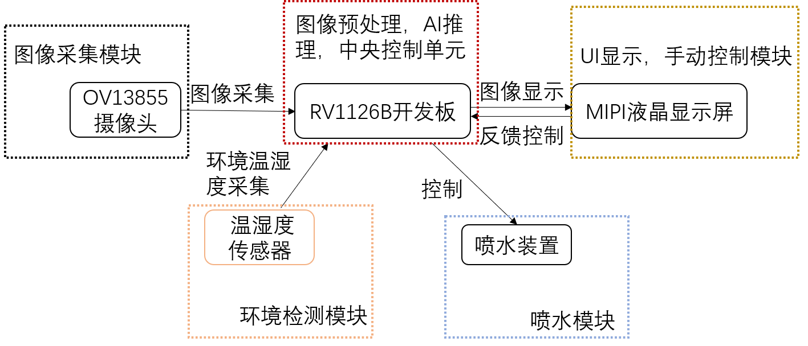

# -RV1126B-AI-
第9届嵌入式芯片与系统设计竞赛

py文件夹中的包括转换.rknn代码，以及py的推理代码。
rv_1126b_qt文件夹是本次项目的核心代码，包括.ui以及各种功能实现代码，推理代码。

基于ELF-RV1126B嵌入式开发板，设计并实现了一套面向消防机器人的端侧AI火源实时检测、跟踪与智能喷水系统。系统以视觉感知为核心，融合YOLO11目标检测、ByteTrack多目标跟踪、卡尔曼滤波预测、分级控制策略及环境传感，构建了从图像采集、AI推理、决策规划到执行机构驱动的完整闭环，旨在解决火灾现场高危环境下人工干预延迟、视觉遮挡及算力资源受限等关键问题。软件架构基于Qt多线程框架，分离界面交互与核心处理任务，确保实时响应。视频采集借助硬件加速单元完成图像预处理，减轻CPU负担；核心检测网络经量化部署，充分利用嵌入式NPU的并行计算能力。
本系统集模型量化部署、硬件加速预处理、多目标跟踪、智能决策与执行控制于一体，具备低功耗、高实时性和强场景适应性，可广泛应用于地面消防机器人、无人机低空巡检、工业固定监测等边缘AI安防场景，为智能消防设备的自主化提供了可行的工程参考。

系统以YOLO11模型为核心，支持Fire、Smoke两类别检测，通过RKNN-Toolkit2进行INT8量化部署，利用RKNN-Toolkit Lite2推理框架与RGA硬件加速单元实现1080p实时推理。引入ByteTrack多目标跟踪算法，实现火源的持续锁定与中心坐标计算；结合火势评估逻辑（基于检测面积与连续帧），智能控制GPIO/PWM驱动水泵进行分级喷水（精准短喷或持续灭火），同时支持DHT11环境温湿度检测与远程协同操作。系统实现检测火源、自主灭火的完整闭环。集成AI-ISP图像增强，有效应对低光、浓烟等复杂环境，进一步提升检测鲁棒性。
    
    应用领域
本系统充分发挥RV1126B端侧3TOPS算力与硬件加速优势，实现从视觉感知、智能决策到执行机构的完整闭环，具备低功耗、高实时性和强场景适应性。可广泛应用于以下领域：
(1).地面消防机器人：作为移动灭火平台的核心视觉与决策单元，实现火源自主检测与定点扑灭。
(2).低空经济无人机巡检：搭载于无人机进行森林防火、高层建筑火情空中侦察。
(3).工业固定监测点：部署于工厂车间、仓库、石油化工等易燃区域。
(4).智能安防：融入智慧城市、社区安防体系，提升火灾预警的智能化水平。

主要性能指标
指标	性能参数
端到端帧率	28-29 FPS
推理帧率	12-12.3 FPS
预处理耗时	7.8-7.9 ms
推理耗时	81-83 ms
跟踪耗时	<0.5 ms
控制耗时	0.14-0.2 ms
端到端延迟	88-92 ms
CPU 占用率	35%-39%

整体框架图

演示视频
<video controls src="DemoVideo.mp4" title="Title"></video>
